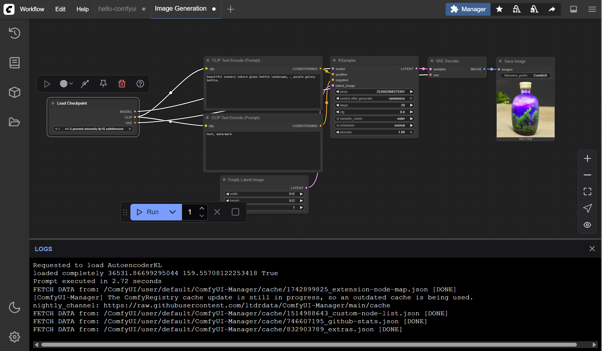

# docker-comfyui

Run ComfyUI Web Server in Docker on Linux with Nvidia GPU Support.



## Prerequisites

- On Debian/Ubuntu Linux
- install Docker
- install Nvidia GPU Driver
- install Nvidia Container Toolkit

refer to `scripts/` dir.

## Quick Start

```
# clone this repo
git clone git@github.com:guoqiao/docker-comfyui.git
cd docker-comfyui/

# clone comfyui repo
git clone git@github.com:comfyanonymous/ComfyUI.git

# optional, checkout a specific branch/tag/version
git checkout v0.3.43

# build docker image
make build

# run comfyui web server
make server

# optional, attach to container to inspect
make attach

# open web server in browser
http://<IP>:8818
```

## ComfyUI Manager

https://docs.comfy.org/essentials/custom_node_overview#comfyui-manager
